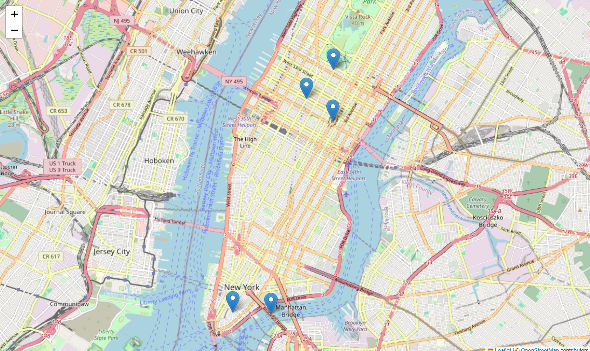

# NYC Traffic Data Project 🚦

This is a small project where I explored live traffic data in New York City using the TomTom API.  
The goal was to practice working with APIs, cleaning the data in pandas, and creating a simple visualization.

## What I did
- Pulled real-time traffic data for a few well-known NYC spots (like Times Square and Wall Street)
- Stored the results in a pandas DataFrame
- Compared current speeds with free-flow speeds to see congestion levels
- Plotted the points on an interactive map with Folium

## Tech Stack
- Python
- Jupyter Notebook
- pandas, requests, folium

## Preview

Here’s a preview of the traffic map:




# NYC Traffic Data Project 🚦  

This is a small project where I explored live traffic data in New York City using the TomTom API. The goal was to practice working with APIs, cleaning the data in pandas, and creating a simple visualization.

---

## Setup Instructions  

### 1. Install dependencies  
```bash
pip install pandas requests folium python-dotenv
```

### 2. Get a TomTom API key  
Sign up at  
https://developer.tomtom.com  

### 3. Create a `.env` file in the same folder as your notebook  
You can create it manually or run this Python code:  
```python
with open(".env", "w") as f:
    f.write("TOMTOM_API_KEY=your_key_here\n")
```
Replace `your_key_here` with your actual TomTom API key.  

### 4. Load the key in your notebook  
```python
from dotenv import load_dotenv
import os

load_dotenv()
TOMTOM_API_KEY = os.getenv("TOMTOM_API_KEY")
```

---

- Adding more locations  
- Automating updates so the data refreshes in real time  
